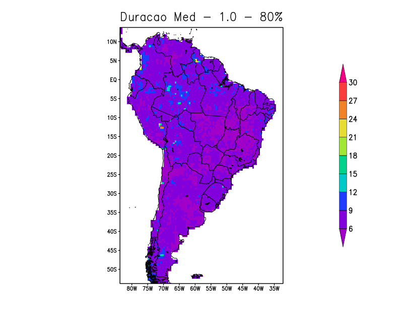

# duracaoSPI

Calcula a duração média e máxima de eventos de uma determinada região.



**Implementado por Eduardo Machado**  
**Ano: 2016**

**Alterações por:**
- **Heric Camargo**  
  **Ano: 2025**  
  **Detalhes:**
    - Makefile para compilação
    - Remoção de warnings e variáveis não utilizadas
    - Combinado os programas média e máximo em um único programa
    - Melhorias de qualidade de vida (Quality of Life improvements)

## Visão Geral do Processo

1. **Entrada de Dados**: O programa lê um diretório de arquivos CTL. (ou um arquivo CTL)
2. **Cálculo**: O programa 'duracaoMaxima.cpp'e 'duracaoMedia' calcula o número de eventos.
3. **Saída de Dados**: A saída é um arquivo de texto, um binário e um CTL nos seus respectivos diretórios.
4. **Plotagem**: Também são plotados gráficos de saída usando o 'GrADS'.

## Requisitos
- **GrADS**: O GrADS é um software de visualização e análise de dados meteorológicos.
- **Compilador C++**: Você provavelmente já tem um instalado no seu sistema.
- **Biblioteca de Matemática**: Você provavelmente já tem uma instalada no seu sistema.

## Como usar

1. **Execução**:
   No terminal, execute o comando:
    ```bash
    ./duracaoSPI.sh [DIRETORIO_OU_ARQUIVO_ENTRADA] [TXT_OU_BIN] [PERCENTAGES] [CUT_LINES]
    ```
    
    > **Atenção**: Este script deve ser executado na **Chagos**. Ele não funciona na minha máquina local.

    Substitua:
    - `[DIRETORIO_OU_ARQUIVO_ENTRADA]` pelo diretório ou arquivo de entrada.
    - `[TXT_OU_BIN]` pelo tipo de saída desejada. (se vazio, os dois)
    - `[PERCENTAGES]` pelo valor da linha de corte. (se vazio, 70% e 80%)
    - `[CUT_LINES]` pelo valor da linha de corte. (se vazio, -2.0 -1.5 1.0 2.0)

    Rodadas:
    Para cada arquivo CTL, todas as linhas de corte e porcentagens são calculadas.

## Exemplo

    ```bash
    ./duracaoSPI.sh saida_composto_0.5_mensal_ams_lab+gpcc
    ```

2. **Saída**:
   Para um diretório com os arquivos CTL de entrada como:

```bash
.
├── dado_composto_ams_mensal_lab+gpcc_spi12.bin
├── dado_composto_ams_mensal_lab+gpcc_spi12.ctl
├── dado_composto_ams_mensal_lab+gpcc_spi24.bin
├── dado_composto_ams_mensal_lab+gpcc_spi24.ctl
├── dado_composto_ams_mensal_lab+gpcc_spi3.bin
├── dado_composto_ams_mensal_lab+gpcc_spi3.ctl
├── dado_composto_ams_mensal_lab+gpcc_spi48.bin
├── dado_composto_ams_mensal_lab+gpcc_spi48.ctl
├── dado_composto_ams_mensal_lab+gpcc_spi60.bin
├── dado_composto_ams_mensal_lab+gpcc_spi60.ctl
├── dado_composto_ams_mensal_lab+gpcc_spi6.bin
└── dado_composto_ams_mensal_lab+gpcc_spi6.ctl
```

A saída será:

```bash
.
├── max / med
│   ├── composto_0.5_mensal_ams_lab+gpcc_spi1 / 3 / 6 / 9 / 12 / 24 / 48 / 60
│   │   ├── 70 / 80
│   │   │   ├── cut_1_0 / 2 / -1 / -1.5 / -2 /
│   │   │   │   ├── composto_0.5_mensal_ams_lab+gpcc_spi1_1.0.bin
│   │   │   │   ├── composto_0.5_mensal_ams_lab+gpcc_spi1_1.0.ctl
│   │   │   │   └── composto_0.5_mensal_ams_lab+gpcc_spi1_1.0.png
│   │   │   └── ...
│   │   └── ...
│   └── ...
└── ...
```

## Melhorias Futuras
1. **Paralelização**: Paralelizar o cálculo do tempo característico para acelerar o processo.
2. **Talvez**: Calcular o SPI direto do programa.
